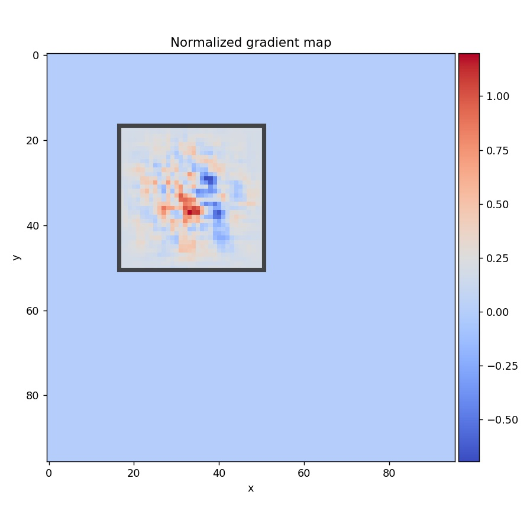

# receptivefield

Gradient based receptive field estimation for Convolutional 
Neural Networks. **receptivefield** uses backpropagation of 
the gradients from output feature map to input image in order to
estimate the size (width, height), stride and offset of resulting
receptive field. Numerical estimation of receptive field can be 
useful when dealing with more complicated neural networks like
ResNet, Inception (see notebooks) where analytical approach of 
computing receptive fields cannot be used.

[](https://travis-ci.org/fornaxai/receptivefield)

# Installation

* Requires: python (in version >= 3.6), keras, tensorflow, numpy, matplotlib, pillow (check requirements.txt) 
* `pip install receptivefield`

# Some remarks

* In order to get better results or even avoid NaNs in the 
estimated receptive field parameters, it is suggested to 
use `Linear` (instead `Relu`) activation and `AvgPool2D` instead of `MaxPool2D`.
This improves gradient flow in the network and hence better signal
in the input image. Note, that this is required only for RF estimation.

* Additionally, one may even initialize network with constant 
positive values in all weights (positive if max pooling is used)
and set biases to zero. In case of Keras API this can be obtained by setting `init_weight=True` 
in the `KerasReceptiveField(init_weight=True)` constructor.

# Limitations

* Numerical approach cannot be used when RF is larger that input image, however 
one may try to increase the input image size, sice RF parameters depend on the architecture not 
image.

# Supported APIs

Currently only Keras and Tensorflow API are supported. However it should be
possible to extend **receptivefield** functionality by deriving
abstract class **ReceptiveField** in base.py file. 

* Keras with `KerasReceptiveField`, example usage in *notebooks/keras_api.ipynb*
* Tensorflow with `TFReceptiveField` example usage in *notebooks/tensorflow_api.ipynb*

# How does it work?

1. Define build_function which returns Keras model

    ```python
    def model_build_func(input_shape=[224, 224, 3]):
        ...
        return Model(input, output)
    ```

2. Compute receptive field parameters with `KerasReceptiveField`

    ```python
    from receptivefield.keras import KerasReceptiveField
    rf_params = KerasReceptiveField(model_build_func).compute(
        input_shape=[224, 224, 3], # this will be passed to model_build_func
        input_layer='input_image', # must exist - usually input image layer
        output_layer='feature_map' # for example last conv layer
    )
    ```
    
3. The `rf_params` is object of class `ReceptiveFieldDescription` e.g.
  
    ```python
    ReceptiveFieldDescription(
            offset=(17.0, 17.0), 
            stride=(4.0, 4.0), 
            size=Size(w=34, h=34)
    )
    ```  
    * `offset` - defines location of the first left-top anchor in the 
    image coordinates (defined in pixels). 
    * `stride` - defines how much RF of the network moves w.r.t unit displacement 
    in the feature_map tensor. 
    * `size` - defines the effective area in the input image which one point 
    in the feature_map tensor is seeing.

# Keras minimal - copy/paste example

* Python code:

    ```python
        from keras.layers import Conv2D, Input, AvgPool2D
        from keras.models import Model
        from receptivefield.image import get_default_image
        from receptivefield.keras import KerasReceptiveField
        
        # define model function
        def model_build_func(input_shape):
            act = 'linear' # see Remarks
            inp = Input(shape=input_shape, name='input_image')
            x = Conv2D(32, (7, 7), activation=act)(inp)
            x = Conv2D(32, (5, 5), activation=act)(x)
            x = AvgPool2D()(x)
            x = Conv2D(64, (5, 5), activation=act, name='feature_grid')(x)
            x = AvgPool2D()(x)
            model = Model(inp, x)
            return model
        
        shape = [64, 64, 3]
        # compute receptive field
        rf = KerasReceptiveField(model_build_func, init_weights=True)
        rf_params = rf.compute(shape, 'input_image', 'feature_grid')
        # debug receptive field
        rf.plot_rf_grid(get_default_image(shape, name='doge'))
    ```
* Logger output + example RF grid
    ```text
    Using TensorFlow backend.
    [2017-11-28 21:47:14,327][ INFO][keras.py]::Feature map shape: (None, 23, 23, 64)
    [2017-11-28 21:47:14,328][ INFO][keras.py]::Input shape      : (None, 64, 64, 3)
    [2017-11-28 21:47:14,471][DEBUG][base.py]::Computing RF at center (11, 11) with offset GridPoint(x=0, y=0)
    [2017-11-28 21:47:14,676][DEBUG][base.py]::Computing RF at center (11, 11) with offset GridPoint(x=1, y=1)
    [2017-11-28 21:47:14,779][DEBUG][base.py]::Estimated RF params: ReceptiveFieldDescription(offset=(10.0, 10.0), stride=(2.0, 2.0), size=Size(w=20, h=20))
    ```
    
    


# Keras more detailed example

Here we show, how to estimate effective receptive field of any Keras model.

* Create model build_function which returns model. This function
should accept one parameter `input_shape`.
    
    ```python
    from keras.layers import Conv2D, Input
    from keras.layers import AvgPool2D
    from keras.models import Model
    
    def model_build_func(input_shape):
        activation = 'linear'
        padding='valid'
        
        inp = Input(shape=input_shape, name='input_image')
        x = Conv2D(32, (5, 5), padding=padding, activation=activation)(inp)
        x = Conv2D(32, (3, 3), padding=padding, activation=activation)(x)
        x = AvgPool2D()(x)
        x = Conv2D(64, (3, 3), activation=activation, padding=padding)(x)
        x = Conv2D(64, (3, 3), activation=activation, padding=padding)(x)
        x = AvgPool2D()(x)
        x = Conv2D(128, (3, 3), activation=activation, padding=padding)(x)
        x = Conv2D(128, (3, 3), activation=activation, padding=padding, name='feature_grid')(x)
    
        model = Model(inp, x)
        return model
    ```

* Check if model is building properly:
    ```python
    model = model_build_func(input_shape=(96, 96, 3))
    model.summary()
    ```
    
    ```text
    _________________________________________________________________
    Layer (type)                 Output Shape              Param #   
    =================================================================
    input_image (InputLayer)     (None, 96, 96, 3)         0         
    _________________________________________________________________
    conv2d_1 (Conv2D)            (None, 92, 92, 32)        2432      
    _________________________________________________________________
    conv2d_2 (Conv2D)            (None, 90, 90, 32)        9248      
    _________________________________________________________________
    average_pooling2d_1 (Average (None, 45, 45, 32)        0         
    _________________________________________________________________
    conv2d_3 (Conv2D)            (None, 43, 43, 64)        18496     
    _________________________________________________________________
    conv2d_4 (Conv2D)            (None, 41, 41, 64)        36928     
    _________________________________________________________________
    average_pooling2d_2 (Average (None, 20, 20, 64)        0         
    _________________________________________________________________
    conv2d_5 (Conv2D)            (None, 18, 18, 128)       73856     
    _________________________________________________________________
    feature_grid (Conv2D)        (None, 16, 16, 128)       147584    
    =================================================================
    Total params: 288,544
    Trainable params: 288,544
    Non-trainable params: 0
    ```

* This step is not required but it is useful to plot results in the
example image. For instance you would like to see what is the size
of network receptive field in comparision to some objects you
wish detect (or localize) by this network.
    
    ```python
    from receptivefield.image import get_default_image
    import matplotlib.pyplot as plt
    # Load sample image of `Lena`.
    image = get_default_image(shape=(32, 32), tile_factor=1)
    plt.imshow(image)
    ```
    
    

* Compute receptive field of the network by calling `rf.compute`

    ```python
    from receptivefield.keras import KerasReceptiveField
    
    rf = KerasReceptiveField(model_build_func, init_weights=False)
    
    rf_params = rf.compute(
        input_shape=image.shape, 
        input_layer='input_image', 
        output_layer='feature_grid'
    )
    print(rf_params)
    
    ```

* The resulting receptive field is:

    ```text
    ReceptiveFieldDescription(
            offset=(17.0, 17.0), 
            stride=(4.0, 4.0), 
            size=Size(w=34, h=34)
    )
    ```

* Input shape: `rf.input_shape==GridShape(n=None, w=96, h=96, c=3)`
* Output feature map shape: `rf.output_shape==GridShape(n=None, w=16, h=16, c=1)`.
 Note, that number of channels in the output feature map is set to 1 but this is
 used internally by `receptivefield`.
 
* You may want to see how gradients backpropagate to the input image. Here
`point=(8, 8)` refers to the (W, H) position of the source signal
from the output grid.
    
    ```python
    
    rf.plot_gradient_at(point=(8, 8), image=None, figsize=(7, 7))
    ```
    
    

* Or even plot whole receptive field grid:

    ```python
    rf.plot_rf_grid(custom_image=image, figsize=(6, 6))
    ```
    
    

* In the above, the red rectangle corresponds to the area which top-left
grid point is seeing in the input image. Blue rectangle corresponds
to the central grid point, green to the bottom-right point. Green dots
show the position of the centers of the grid anchors in the source
image. 
