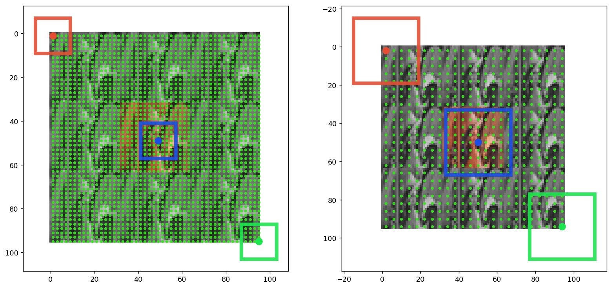

# receptivefield

Gradient based receptive field estimation for Convolutional 
Neural Networks. **receptivefield** uses backpropagation of 
the gradients from output feature map to input image in order to
estimate the size (width, height), stride and offset of resulting
receptive field. Numerical estimation of receptive field can be 
useful when dealing with more complicated neural networks like
ResNet, Inception (see notebooks) where analytical approach of 
computing receptive fields cannot be used.

# Installation

* `pip install receptivefield` inside the project.

# Some remarks

* In order to get better results or even avoid NaNs in the 
estimated receptive field parameters, it is suggested to 
use `Linear` (instead `Relu`) activation and `AvgPool2D` instead of `MaxPool2D`.
This improves gradient flow in the network and hence better signal
in the input image. Note, that this is required only for RF estimation.

* Additionally, one may even initialize network with constant 
positive values in all weights (positive if max pooling is used)
and set biases to zero. In case of Keras API this can be obtained by setting `init_weight=True` 
in the `KerasReceptiveField(init_weight=True)` constructor.

# Keras Example

Currently only Keras API is supported. However it should be
possible to extend **receptivefield** functionality by deriving
abstract class **ReceptiveField** in base.py file. Here we show
how to estimate effective receptive field of any Keras model.

* Create model build_function which returns model. This function
should accept one parameter `input_shape`.

```python
from keras.layers import Conv2D, Input
from keras.layers import AvgPool2D
from keras.models import Model

def model_build_func(input_shape):
    activation = 'linear'
    padding='valid'
    
    inp = Input(shape=input_shape, name='input_image')
    x = Conv2D(32, (5, 5), padding=padding, activation=activation)(inp)
    x = Conv2D(32, (3, 3), padding=padding, activation=activation)(x)
    x = AvgPool2D()(x)
    x = Conv2D(64, (3, 3), activation=activation, padding=padding)(x)
    x = Conv2D(64, (3, 3), activation=activation, padding=padding)(x)
    x = AvgPool2D()(x)
    x = Conv2D(128, (3, 3), activation=activation, padding=padding)(x)
    x = Conv2D(128, (3, 3), activation=activation, padding=padding, name='feature_grid')(x)

    model = Model(inp, x)
    return model
```

* Check if model is building properly:
```python
model = model_build_func(input_shape=(96, 96, 3))
model.summary()
```

```txt
_________________________________________________________________
Layer (type)                 Output Shape              Param #   
=================================================================
input_image (InputLayer)     (None, 96, 96, 3)         0         
_________________________________________________________________
conv2d_1 (Conv2D)            (None, 92, 92, 32)        2432      
_________________________________________________________________
conv2d_2 (Conv2D)            (None, 90, 90, 32)        9248      
_________________________________________________________________
average_pooling2d_1 (Average (None, 45, 45, 32)        0         
_________________________________________________________________
conv2d_3 (Conv2D)            (None, 43, 43, 64)        18496     
_________________________________________________________________
conv2d_4 (Conv2D)            (None, 41, 41, 64)        36928     
_________________________________________________________________
average_pooling2d_2 (Average (None, 20, 20, 64)        0         
_________________________________________________________________
conv2d_5 (Conv2D)            (None, 18, 18, 128)       73856     
_________________________________________________________________
feature_grid (Conv2D)        (None, 16, 16, 128)       147584    
=================================================================
Total params: 288,544
Trainable params: 288,544
Non-trainable params: 0
```

* This step is not required but it is useful to plot results in the
example image. For instance you would like to see what is the size
of network receptive field in comparision to some objects you
wish detect (or localize) by this network.

```python
from receptivefield.image import get_default_image
import matplotlib.pyplot as plt
# Load sample image of `Lena`.
image = get_default_image(shape=(32, 32), tile_factor=1)
plt.imshow(image)
```


* Compute receptive field of the network by calling `rf.compute`

```python
from receptivefield.keras import KerasReceptiveField

rf = KerasReceptiveField(model_build_func, init_weights=False)

rf_params = rf.compute(
    input_shape=image.shape, 
    input_layer='input_image', 
    output_layer='feature_grid'
)
print(rf_params)

```

* The resulting receptive field is:

```txt
ReceptiveFieldDescription(offset=(17.0, 17.0), stride=(4.0, 4.0), size=Size(w=34, h=34))
```

* Input shape: `rf.input_shape==GridShape(n=None, w=96, h=96, c=3)`
* Output feature map shape: `rf.output_shape==GridShape(n=None, w=16, h=16, c=1)`.
 Note, that number of channels in the output feature map is set to 1 but this is
 used internally by `receptivefield`.
 
* You may want to see how gradients backpropagate to the input image. Here
`point=(8, 8)` refers to the (W, H) position of the source signal
from the output grid.

```python

rf.plot_gradient_at(point=(8, 8), image=None, figsize=(7, 7))
```


* Or even plot whole receptive field grid:

```python
rf.plot_rf_grid(custom_image=image, figsize=(6, 6))
```



* In the above, the red rectangle corresponds to the area which top-left
grid point is seeing in the input image. Blue rectangle corresponds
to the central grid point, green to the bottom-right point. Green dots
show the position of the centers of the grid anchors in the source
image. 
